<p>
  
</p>
<p><i>Open source tools for every layer of government service delivery.</i></p>
<p><b>Strata is a gold-standard target architecture and suite of open-source tools that gives government agencies everything they need to run a modern service.</b></p>

<h4 align="center">
  <a href="https://github.com/navapbc/strata-documentai-api-enterprise/blob/main/LICENSE">
    
  </a>
  <a href="https://github.com/navapbc/strata-documentai-api-enterprise/blob/main/CONTRIBUTING.md">
    
  </a>
  <a href="https://github.com/navapbc/strata-documentai-api-enterprise/commits/main">
    
  </a>
</h4>

# DocumentAI API

Open source tools for document processing and intelligent data extraction. 

DocumentAI API is a serverless document processing platform that helps teams upload documents, extract structured data, manage tenants and API keys, and review results through an admin console for operating document extraction workflows.

This repository is a complete DocumentAI API application. It includes the API, admin UI, infrastructure, documentation, and deployment scripts needed to run the platform in AWS.

For Strata template applications, see [`navapbc/strata`](https://github.com/navapbc/strata).

> ⚠️ **Public Preview / Active Development (June 2026)**
> This project is under active development, but is being designed for out-of-the-box use. APIs, configuration, and features may change.

## Features

- API for uploading, identifying, and extracting data from document files
- Serverless FastAPI application deployed on AWS Lambda
- Document processing with Bedrock Data Automation
- Multi-tenant API key authentication and authorization
- Admin console for managing tenants, users, API keys, and extraction rules
- Terraform infrastructure for the full serverless stack
- Metrics pipeline for document processing and platform usage
- Cognito-backed admin authentication with MFA support

## Getting Started
### Repo structure
```
├── documentai-api/     # Python API using FastAPI on Lambda
├── admin-ui/           # Admin console (vanilla JS SPA)
├── infra/              # Terraform infrastructure
├── docs/               # Architecture diagrams and specs
├── .github/            # CI/CD workflows
└── Makefile            # Commands for setup, deploy, and teardown
```

### Requirements

Before getting started, install and configure:

- AWS CLI
- Terraform 1.10 or newer
- Docker
- Node.js 18 or newer
- Python 3.11 or newer with [uv](https://github.com/astral-sh/uv)

You will also need an AWS profile with permission to create the required infrastructure.

### Setup

To set up the application for the first time:

1. Configure your AWS profile.

```bash
export AWS_PROFILE=your-profile
```

2. Create the Terraform state bucket. This only needs to happen once per environment.

```bash
cd infra
make infra-bootstrap ENVIRONMENT=dev
make infra-init ENVIRONMENT=dev
```

3. Deploy the infrastructure and admin UI.

```bash
cd ..
make deploy
```

The deploy command builds the API, applies the Terraform infrastructure, builds the admin UI, uploads it to S3, and updates CloudFront. The admin UI configuration is generated automatically during deployment.

### Local development

#### API

To run the API locally with Docker:

```bash
cd documentai-api
cp local.env.example .env
make init
make start
```

The API will run at `localhost:8000`.

To run without Docker:

```bash
make init-local
export RUN_CMD_APPROACH=local
make start-local
```

#### Admin UI

```bash
cd admin-ui
npm install
cp config.example.json config.json
npm run dev
```

The admin UI will run at `localhost:3000`. If you have not deployed the infrastructure yet, update `admin-ui/config.json` with the API endpoint and Cognito values you want to use.

### Deploy

From the repository root:

```bash
make deploy
```

You can also deploy pieces separately:

```bash
make deploy-infra
make deploy-ui
```

To use a specific environment or AWS profile:

```bash
make deploy ENVIRONMENT=dev AWS_PROFILE=my-profile
```
> **Note**: Region is configured in `infra/environments/<env>/terraform.tfvars`. The state bucket is created in `us-east-1` by default.

Only the `dev` environment exists today. To add another environment, copy `infra/environments/dev/` and update its `terraform.tfvars`.

### Teardown

To remove the deployed infrastructure:

```bash
cd infra
make infra-destroy ENVIRONMENT=dev
```

## Components

### documentai-api/

FastAPI application deployed as a Lambda container. Handles document upload and processing via Bedrock Data Automation, multi-tenant API key authentication, extraction rule configuration, and metrics collection.

```bash
cd documentai-api
make start        # Local development server (Docker)
make test         # Run pytest suite
make test-e2e     # Run e2e suite
make lint         # Ruff + mypy
```

> [!NOTE]
> The `e2e` and `integration` test suites run against **synthetic, fake sample documents**
> that contain no real data. See
> [test-documents/README.md](documentai-api/tests/helpers/fixtures/test-documents/README.md)
> for details on the test data and how to report a concern.

### admin-ui/

Single-page admin console for managing the platform. Features API key lifecycle management, tenant and user management with role-based access, extraction rule editor, document viewer, and Cognito auth with TOTP MFA.

```bash
cd admin-ui
npm run dev       # Dev server at localhost:3000
npm test          # Unit tests (Vitest)
npm run test:e2e  # e2e tests (Playwright)
```

### infra/

Terraform modules for the complete serverless stack. See [infra/README.md](infra/README.md) for the full module list and usage.

```bash
cd infra
make infra-plan   # Terraform plan
make infra-apply  # Terraform apply
```

## Architecture

At a high level:

1. A client uploads a document through the API Gateway to Lambda.
2. The document is stored in S3 and metadata in DynamoDB.
3. EventBridge triggers the document processor Lambda.
4. The processor invokes Bedrock Data Automation with a tenant-specific blueprint.
5. BDA writes results to S3.
6. The result processor Lambda extracts fields and updates DynamoDB.
7. Metrics are emitted to SQS, processed into Parquet via Glue, and stored in S3.

The system follows an event-driven architecture:



The diagram source lives in [`architecture.mmd`](docs/documentai-api/diagrams/architecture.mmd).

## Auth

- **API clients**: `API-Key` header, DynamoDB-backed and tenant-scoped
- **Admin users**: Cognito JWT with super-admin or tenant-admin roles
- **Dual auth**: Endpoints support both via `get_user_context_with_fallback`

## Contributing

For more information about our contribution guidelines, see
[CONTRIBUTING.md](CONTRIBUTING.md). All contributors are expected to follow our
[Code of Conduct](CODE_OF_CONDUCT.md).

## License

This project is licensed under the Apache 2.0 License. See the [LICENSE](LICENSE) file for details.