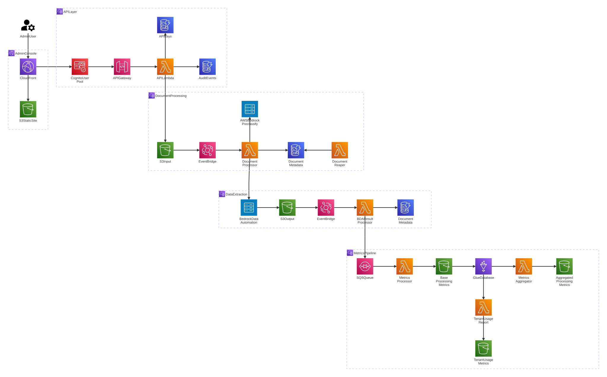

<p>
  
</p>
<p><i>Open source tools for every layer of government service delivery.</i></p>
<p><b>Strata is a gold-standard target architecture and suite of open-source tools that gives government agencies everything they need to run a modern service.</b></p>

<h4 align="center">
  <a href="https://github.com/navapbc/strata-documentai-api-enterprise/blob/main/LICENSE">
    
  </a>
  <a href="https://github.com/navapbc/strata-documentai-api-enterprise/blob/main/CONTRIBUTING.md">
    
  </a>
  <a href="https://github.com/navapbc/strata-documentai-api-enterprise/commits/main">
    
  </a>
</h4>

# DocumentAI API

A serverless document processing platform - upload documents, extract structured data, and manage the full pipeline through an admin console.

For Strata template applications, see [`navapbc/strata`](https://github.com/navapbc/strata).

> ⚠️ **Public Preview / Active Development (June 2026)**
> This project is under active development, but is being designed for out-of-the-box use. APIs, configuration, and features may change.

## See it in action

**Local API setup** - clone, configure, wire in real dev AWS resources, and watch a document get processed end to end from a local container.


**Admin console** - tenant and user management, API keys, document review.


**Extraction rules** - configure per-tenant, per-document-type field rules.


**Demo UI** - upload a document and view extraction results with bounding box overlay.


## How it works

A client uploads a document via the API. It's stored in S3 and queued for processing via EventBridge. A processor Lambda invokes Bedrock Data Automation with a tenant-specific blueprint, writes results back to S3, and a second Lambda extracts fields into DynamoDB. Metrics flow through SQS into Parquet via Glue.



## Features

- **[Document upload and processing](docs/documentai-api/document-processing.md)** - Bedrock Data Automation blueprints, with Textract AnalyzeID for IDs and passports; supports typed and handwritten documents in English and other configured languages
- **[Document viewer](docs/documentai-api/document-viewer.md)** - extracted fields with bounding box overlay linked to the source image
- **[Configurable extraction rules engine](docs/documentai-api/extraction-rules.md)** - required, optional, and excluded fields per tenant and document type with structured codes for issues
- **[Multi-tenancy with role-based access](docs/documentai-api/access-control.md)** - tenant-admin and super-admin roles, tenant-scoped API keys
- **[Authorization](docs/documentai-api/authorization.md)** - Cognito with TOTP MFA, optional Google SSO, and API key support for programmatic clients
- **[Admin console](ui/admin/README.md)** - manage tenants, users, API keys, extraction rules, and review processed documents
- **[Demo environment](ui/demo/README.md)** - upload documents and view extraction results without tenant configuration
- **[Metrics pipeline](docs/documentai-api/metrics-pipeline.md)** - SQS -> Glue -> S3 (Parquet), queryable per tenant
- **[Observability](docs/documentai-api/observability.md)** - distributed tracing via OpenTelemetry and X-Ray, CloudWatch Application Signals for per-service Latency/Error/Fault metrics, CloudWatch dashboard
- **[Serverless Terraform infrastructure](infra/README.md)** - Lambda containers, API Gateway, CloudFront, DynamoDB, S3


## Repo structure

```
├── documentai-api/     # Python FastAPI on Lambda
├── ui/
│   ├── shared/         # Shared utilities, styles, and recording fixtures
│   ├── admin/          # Admin console (vanilla JS SPA)
│   └── demo/           # Demo UI (upload + extraction with bbox overlay)
├── infra/              # Terraform infrastructure
├── docs/               # Architecture diagrams and specs
├── .github/            # CI/CD workflows
└── Makefile            # Commands for setup, deploy, and teardown
```

## Get started

- [Setup and deploy](SETUP.md) - requirements, first-time bootstrap, deploy, teardown
- [DocumentAI API](documentai-api/README.md) - API reference and development
- [Postman collection](docs/documentai-api/postman/DocumentAI.postman_collection.json) - import to explore the API locally (no AWS needed)

## Contributing

For more information about our contribution guidelines, see
[CONTRIBUTING.md](CONTRIBUTING.md). All contributors are expected to follow our [Code of Conduct](CODE_OF_CONDUCT.md).

## License

This project is licensed under the Apache 2.0 License. See the [LICENSE](LICENSE) file for details.
