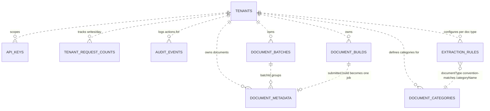

# DocumentAI Data Model

Reference for the DynamoDB tables behind DocumentAI, how they relate to each
other, and what to know before building on top of them (e.g. an external
management layer). Assembled from `infra/environments/dev/main.tf` and the
corresponding model/schema files in `documentai-api/src/documentai_api`.

For the request/processing flow, see the [architecture diagram](diagrams/architecture.mmd)
and [request lifecycle diagram](diagrams/request-lifecycle.mmd). Note the
architecture diagram currently focuses on the core upload -> extraction ->
metrics pipeline and doesn't depict the admin-console-driven tables covered
here (`document_batches`, `document_builds`, `extraction_rules`,
`document_categories`, `tenant_request_counts`).

All tables are `PAY_PER_REQUEST`, encrypted with a per-table KMS key, and have
point-in-time recovery enabled (see `infra/modules/nosql`).

## Entity relationships

See [`diagrams/data-model-erd.mmd`](diagrams/data-model-erd.mmd).

DynamoDB does not have foreign keys - every relationship in that diagram is enforced
in application code (mostly via `tenantId`), not by the database. The dotted
lines below are mermaid's "non-identifying relationship" style, used here
deliberately to signal a logical/app-enforced link rather than a real FK
constraint.

## Table reference

### `document_metadata`

Core tracking record for every uploaded document - one row per file, updated
in place as it moves through preclassification, BDA extraction, and result
processing.

- **PK:** `fileName` (S)
- **GSIs:** `jobId` &middot; `externalDocumentId` &middot; `bdaInvocationId` &middot; `tenantId` + `createdAt` &middot; `processStatus` + `createdAt`
- **TTL:** yes (`ttl`)
- Other fields: `systemDocumentId`, `batchId`, `userProvidedDocumentCategory`, `apiKeyName`, `extractionMethod`, `fieldConfidenceScores`, `isDemo`

### `tenants`

One row per tenant. Root of the multi-tenancy model - almost every other table "joins" back to this on `tenantId`.

- **PK:** `tenantId` (S)
- **GSIs:** none
- Fields: `displayName`, `primaryContact`, `isActive`, `extractionConfidenceFloor`, `maxWritesPerDay`, `maxWritesPerMonth`, `createdAt`, `updatedAt`

### `api_keys`

API key credentials for programmatic clients. Keyed by hash, raw key is never stored; scoped to a tenant.

- **PK:** `keyHash` (S)
- **GSIs:** `tenantId` + `apiKeyName`
- Fields: `environment`, `isActive`, `expiresAt`, `lastUsed`, `createdBy`, `emailAddress`

### `tenant_request_counts`

Daily write counters per tenant, used to enforce `maxWritesPerDay` /
`maxWritesPerMonth` rate limits.

- **PK:** `tenantId` (S)
- **SK:** `date` (S)
- **GSIs:** none
- **TTL:** yes (`ttl`)
- Fields: `count`

### `audit_events`

Admin-console and API audit trail - who did what, to which resource, when.
Queryable by tenant, by action, or by actor.

- **PK:** `tenantId` (S)
- **SK:** `timestamp#eventId` (S)
- **GSIs:** `action` + `timestamp#eventId` &middot; `actorEmail` + `timestamp#eventId`
- **TTL:** yes (`ttl`)
- Fields: `eventId`, `actorSub`, `actorEmail`, `action`, `targetType`, `targetId`, `metadata`

### `extraction_rules`

Per-tenant, per-document-type field requirements - which fields must be
present, which are optional, for extraction to be considered complete.

- **PK:** `tenantId` (S)
- **SK:** `documentType` (S)
- **GSIs:** none
- Fields: `requiredFields[]`, `optionalFields[]`, `blueprintArn`, `createdAt`, `updatedAt`

### `document_categories`

Per-tenant document type registry - drives classification routing and can be
auto-registered from observed uploads.

- **PK:** `tenantId` (S)
- **SK:** `categoryName` (S)
- **GSIs:** none
- Fields: `displayName`, `description`, `isActive`, `isAutoRegistered`, `processingPercentage`, `createdAt`, `updatedAt`

### `document_batches`

Groups multiple single-page uploads submitted together into one client-facing
batch, with aggregate status.

- **PK:** `batchId` (S)
- **GSIs:** `batchStatus` + `createdAt` &middot; `tenantId` + `createdAt`
- **TTL:** yes (`ttl`)
- Fields: `totalFiles`, `resolvedCount`, `category`, `apiKeyName`, `errorMessage`, `updatedAt`

### `document_builds`

Assembles multiple uploaded pages into one logical multi-page document before
submission; one item per page under a shared `buildId`.

- **PK:** `buildId` (S)
- **SK:** `pageNumber` (N)
- **GSIs:** `tenantId` + `createdAt` &middot; `externalReferenceId`
- **TTL:** yes (`ttl`)
- Fields: `originalFileName`, `category`, `s3Path`, `submittedAt`, `externalDocumentId`, `externalSystemId`, `aiConsentFlag`, `isBuildMetadata`, `apiKeyName`, `uploadSource`

## Notes for building on top the existing model

- **No referential integrity.** Every cross-table link above (`tenantId`,
  `batchId`, `categoryName` <-> `documentType`) is convention, enforced in
  application code at write time - DynamoDB will not stop an orphaned
  `batchId` or a typo'd category name. Any external management UI that lets
  someone edit these needs its own validation.
- **`tenantId` is the universal join key.** A tenant-scoped view is a
  `Query` against a GSI on almost every table, not a table scan - that's why
  every multi-tenant table carries a `tenantId` GSI.
- **TTL tables self-delete.** `document_metadata`, `document_batches`,
  `document_builds`, `tenant_request_counts`, and `audit_events` all carry a
  `ttl` attribute and will disappear on their own schedule - anything that
  needs longer retention has to copy data out before TTL fires, not rely on
  the primary table as an archive.
- **`document_builds` is temporary by design.** It holds in-progress multi-page 
  assembly and is expected to be superseded by a single `document_metadata` record 
  once submitted - don't model it as a permanent parent of the document.
