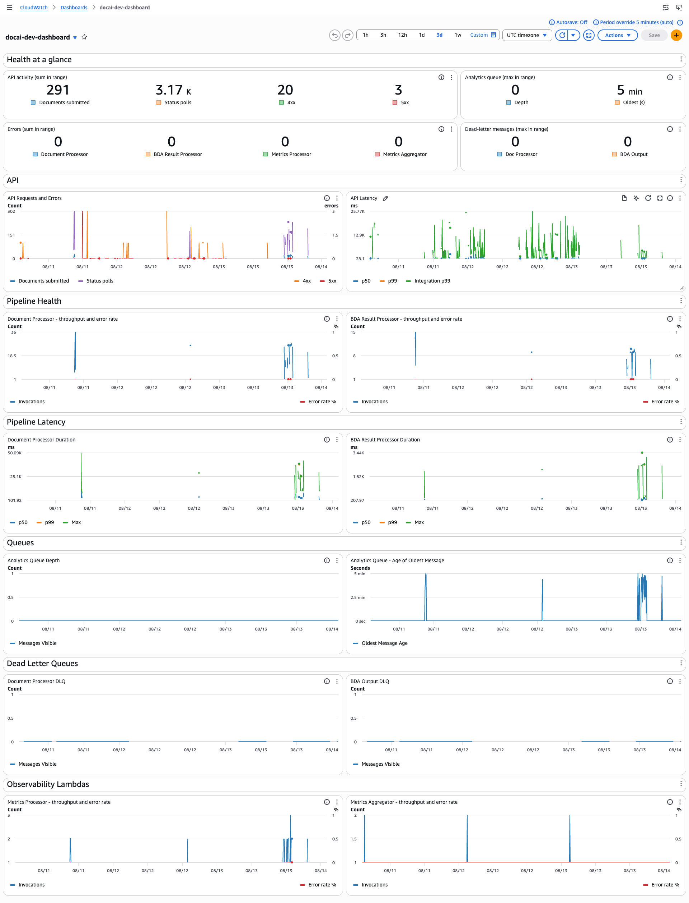

# Observability

The platform uses OpenTelemetry (OTEL) for distributed tracing via the `aws-otel-python-instrumentation` Lambda layer, with per-service metrics derived by CloudWatch Application Signals.

## Enabling tracing

Tracing is off by default in code (`OTEL_SDK_DISABLED=true` in `OtelConfig`). The `otel_enabled` Terraform variable controls whether it is enabled for a given deployment. When enabled, the following env vars are set on all Lambda functions:

```
OTEL_SDK_DISABLED=false
OTEL_AWS_APPLICATION_SIGNALS_ENABLED=true
OTEL_METRICS_EXPORTER=awsemf
OTEL_EXPORTER_OTLP_LOGS_HEADERS=x-aws-metric-namespace=documentai-api
```

See [environment-variables.md](environment-variables.md#opentelemetry) for the full variable reference.

Both the API Lambda (`api-gateway` module) and worker Lambdas (`worker` module) have `CloudWatchLambdaApplicationSignalsExecutionRolePolicy` attached to their IAM roles, which grants the permissions Application Signals needs to publish metrics.

**`tracing_config { mode = "Active" }` on both Lambda modules is required, not optional.** The `aws-otel-python-instrumentation` layer ignores `OTEL_EXPORTER_OTLP_ENDPOINT` in a Lambda environment. If no explicit traces-specific OTLP endpoint is set, it silently swaps the span exporter to target Lambda's native X-Ray daemon over UDP at `127.0.0.1:2000`. That daemon only exists when Active Tracing is enabled. Without it, spans are generated and DDB/SQS-bridged correctly, but every export silently disappears - no errors exist, as UDP sends are fire-and-forget. 
> Any new Lambda module added to this pipeline needs the same `tracing_config { mode = "Active" }` block or it will reproduce this exact silent failure mode.

## Trace propagation

The platform has two async processing legs, each bridging a trace context across a service boundary:

### API → BDA result processor (DynamoDB bridge)

1. During document processing, the API injects a W3C `traceparent` into the DynamoDB record via `document_lifecycle.py`.
2. When the BDA result processor Lambda is invoked, it reads the `traceparent` from the DDB record and restores the parent span context before starting the `bda.result_process` span.

### API → metrics processor (SQS bridge)

1. When a metrics event is enqueued in `ddb.py`, the current span context is injected as a W3C `traceparent` into the SQS message's `MessageAttributes`.
2. When the metrics processor Lambda receives the message, it extracts the `traceparent` from `messageAttributes` and restores the parent span context before processing.

Both legs use the W3C Trace Context propagation format (`traceparent` header) via the OTEL Python SDK's `inject`/`extract` API.

## Application Signals

When enabled, Application Signals automatically derives Latency, Error, and Fault metrics from trace data for each service. These metrics are published to CloudWatch and retained for 15 months, compared to X-Ray's 30-day trace retention.

Metrics appear in CloudWatch under the fixed `ApplicationSignals` namespace, not under `OTEL_SERVICE_NAME`. The `OTEL_EXPORTER_OTLP_LOGS_HEADERS` setting controls the EMF log namespace used internally by the layer, not the Application Signals namespace.

## CloudWatch dashboard

A CloudWatch dashboard is provisioned by the `monitoring` Terraform module (`infra/modules/monitoring/dashboard.tf`). It is enabled when `create_dashboard = true` and named `{project_name}-{environment}-dashboard` (deliberately excludes the account ID, unlike other resource names in this project).



The dashboard is organized into sections:

- Health at a glance - single-value scorecards for documents submitted, API 4xx/5xx, Lambda errors per function, DLQ depths, and analytics queue depth/age
- API - request volume, error counts, and p50/p99/integration latency from API Gateway
- Pipeline Health - invocation throughput and error rate % for Document Processor and BDA Result Processor
- Pipeline Latency - p50/p99/max duration for the same pipeline Lambdas
- Queues - analytics queue depth and age of oldest message
- Dead Letter Queues - message depth for the Document Processor and BDA Output DLQs
- Observability Lambdas - throughput and error rate % for Metrics Processor and Metrics Aggregator

Widgets are emitted conditionally - if a resource (e.g. a DLQ or the API Gateway) is not configured for an environment, its section is omitted rather than rendering with null dimensions.

## Local development

Tracing is disabled by default locally (`OTEL_SDK_DISABLED=true`). The `setup()` call in `telemetry.py` is a no-op when disabled, so no collector or ADOT sidecar is needed for local development or testing.
