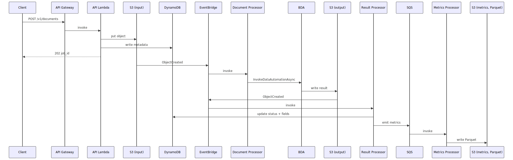

# DocumentAI API

Python API for document processing, classification, and data extraction using AWS Bedrock Data Automation.

## Overview

A serverless document processing system deployed as a Lambda container. Handles document upload, intelligent classification, field extraction, multi-tenant API key management, and admin operations.

## Architecture

The system follows an event-driven architecture:


The diagram source lives in [`architecture.mmd`](../docs/documentai-api/diagrams/architecture.mmd).

**Processing Flow:**
1. Document uploaded via API endpoint, stored in S3, metadata written to DynamoDB
2. EventBridge triggers Document Processor Lambda
3. Document Processor invokes Bedrock Data Automation with tenant-specific blueprint
4. BDA writes results to S3 output bucket
5. EventBridge triggers BDA Result Processor to extract fields and update DynamoDB
6. Metrics emitted to SQS → Metrics Processor → S3 (Parquet) → Glue

The request lifecycle across these components:



The diagram source lives in [`request-lifecycle.mmd`](../docs/documentai-api/diagrams/request-lifecycle.mmd).

## Features

- **Bedrock Data Automation** - Multi-project BDA with per-category blueprint routing
- **Multi-tenant** - API key auth (DynamoDB-backed) with tenant isolation
- **Admin API** - Tenant, user, API key, extraction rule, and document category management
- **Cognito JWT auth** - Admin endpoints secured with Cognito User Pool tokens
- **Metrics pipeline** - SQS → Lambda → S3 Parquet → Glue with partition projection
- **Audit logging** - All admin actions recorded
- **Multi-format** - PDF, JPEG, PNG, TIFF support
- **Sync + async** - Upload with optional `?wait=true` for synchronous processing

## File Requirements

| Format | Max Size |
|--------|----------|
| PDF | 500 MB |
| JPEG, PNG, TIFF | 5 MB |

- PDFs > 5 pages are trimmed to first 5 (set by `MAX_PAGES_PER_DOCUMENT` in `config/constants.py`)
- Documents must not be password-protected
- Minimum 50 characters of text content

## Prerequisites

- Python 3.11+
- [uv](https://docs.astral.sh/uv/getting-started/installation/)
- Docker & Docker Compose (for local dev)
- Make

## Quick Start

```bash
cp local.env.example .env    # First time only
make init                    # Build Docker containers
make start                   # Start API at localhost:8000
```

Or without Docker:

```bash
make init-local
export RUN_CMD_APPROACH=local
make start-local
```

## Development Commands

### Using Make (macOS/Linux)

| Command | Description |
|---------|-------------|
| `make init` | Build Docker containers |
| `make start` | Start services (detached) |
| `make run-logs` | Start with log output |
| `make check` | Run all checks (format, lint, test, test-audit) |
| `make test` | Run pytest suite |
| `make test-coverage` | Tests with coverage report |
| `make test-parallel` | Tests in parallel |
| `make lint` | Ruff linter |
| `make format` | Ruff formatter |

### Using tasks.py (cross-platform, Windows/macOS/Linux)

For environments without Make (e.g. Windows PowerShell), use the task runner:

```bash
uv run tasks.py <task> [args...]
```

| Command | Description |
|---------|-------------|
| `uv run tasks.py test` | Run pytest suite |
| `uv run tasks.py test-coverage` | Tests with coverage report |
| `uv run tasks.py test-parallel` | Tests in parallel |
| `uv run tasks.py check` | All checks (read-only: format check, lint, test) |
| `uv run tasks.py precommit` | Pre-push: format, lint (with fix), test |
| `uv run tasks.py format` | Format code |
| `uv run tasks.py lint` | Lint with auto-fix |
| `uv run tasks.py lint-check` | Lint without modifying |
| `uv run tasks.py typecheck` | Type check with mypy |
| `uv run tasks.py dev` | Start server with reload |
| `uv run tasks.py start` | Start server (production mode) |
| `uv run tasks.py openapi-spec` | Export OpenAPI spec to docs |
| `uv run tasks.py clean` | Remove build artifacts |
| `uv run tasks.py help` | Show all available tasks |

## Configuration

### Required Environment Variables

Set by infrastructure on deploy:

| Variable | Description |
|----------|-------------|
| `DOCUMENTAI_INPUT_LOCATION` | S3 bucket for uploads |
| `DOCUMENTAI_OUTPUT_LOCATION` | S3 bucket for BDA results |
| `DOCUMENTAI_DOCUMENT_METADATA_TABLE_NAME` | DynamoDB documents table |
| `BDA_PROJECT_ARN` | Bedrock Data Automation project ARN |
| `BDA_PROFILE_ARN` | BDA profile ARN |
| `BDA_REGION` | AWS region for BDA |
| `API_AUTH_ENABLED` | Enable DynamoDB-backed auth. Defaults to `false` (insecure single-key dev mode); **must be `true` for any hosted/production deploy** - see [api-authentication.md](../docs/documentai-api/api-authentication.md) |
| `API_KEYS_TABLE_NAME` | DynamoDB API keys table |
| `COGNITO_USER_POOL_ID` | Cognito User Pool ID (admin auth) |

### Optional

| Variable | Default | Description |
|----------|---------|-------------|
| `API_AUTH_CACHE_TTL` | `300` | API key cache TTL (seconds) |
| `API_AUTH_INSECURE_SHARED_KEY` | - | Static API key for local dev (bypasses DynamoDB) |
| `HOST` | `localhost` | API host |
| `PORT` | `8000` | API port |
| `ENVIRONMENT` | `local` | Environment name |

> **Local dev**: The default `.env` (copied from `local.env.example`) sets `API_AUTH_INSECURE_SHARED_KEY=local-dev-key`, which enables a static key bypass without DynamoDB. Use `API-Key: local-dev-key` in requests.

## API Endpoints

Full API documentation is available at `/docs` (Swagger UI) and `/openapi.json` when the server is running. A snapshot is committed at [docs/documentai-api/openapi.json](../docs/documentai-api/openapi.json) - regenerate with `uv run export-openapi`.

See the [API route map](../docs/documentai-api/diagrams/api-routes.mmd) for a visual overview grouped by auth scheme.

### Document Processing (API-Key auth)

```bash
# Async upload
curl -X POST http://localhost:8000/v1/documents \
  -H "API-Key: your-key" \
  -F "file=@document.pdf" \
  -F "category=income"

# Sync upload (wait for result)
curl -X POST "http://localhost:8000/v1/documents?wait=true&timeout=120" \
  -H "API-Key: your-key" \
  -F "file=@document.pdf" \
  -F "category=income"
```

The `category` field must match a configured document category for the tenant.

### Routes by auth scheme

See `/docs` for the complete list. Routes grouped by auth method:

**API-Key header** (ingestion / client-facing):
- `/v1/documents`, `/v1/documents/{job_id}`, `/v1/documents/search`
- `/v1/documents/batch`, `/v1/batches/{batch_id}`
- `/v1/documents/presigned-url`
- `/v1/builds`

**Cognito JWT** (admin console):
- `/v1/admin/*` - api-keys, tenants, users, audit-log, documents, document-categories, blueprints/test

**Dual auth (either)**:
- `/v1/config/extraction-rules`
- `/v1/dictionary/*`
- `/v1/metrics`
- `/v1/me`

**Unauthenticated**:
- `/health`

### Creating Tenants

Tenants can be created via:
- **Admin API**: `POST /v1/admin/tenants`
- **CLI**: `uv run tenants create --tenant-id my-tenant --display-name "My Tenant"`
- **Make**: `make tenant TENANT=my-tenant DISPLAY_NAME="My Tenant"`

Additional CLI commands: `tenants list`, `tenants deactivate`.

### Creating API Keys

API keys can be created via:
- **Admin UI**: Keys → Create Key
- **Admin API**: `POST /v1/admin/api-keys`
- **CLI**: `uv run api-keys generate --api-key-name my-service --environment dev`

Additional CLI commands: `api-keys list`, `api-keys deactivate`.

### Generating Usage Reports

A per-tenant monthly usage report (pages, bytes, Bedrock tokens) is produced by a
scheduled Lambda (`usage-report`) that runs daily. To generate one on demand
against a deployed environment:

```bash
make usage-report MONTH=2026-01
```

Requires AWS access and these env vars: `DDB_EXPORT_BUCKET_NAME`, `GLUE_DATABASE_NAME`,
`DDB_RAW_DATA_TABLE_NAME`, `ATHENA_WORKGROUP_NAME`. Runs an Athena query over the raw
metrics data and writes `usage-report/month=<MONTH>/report.json` to the metrics bucket.

> **Note:** Running this overwrites the existing report for that month. The report can
> only cover data still in the raw metrics table - if S3 lifecycle rules have archived
> or expired older records, those months will be incomplete or empty.

## Testing

Most tests use pytest with moto for AWS service mocking - no real AWS infrastructure required. Tests are split into three tiers via pytest markers:

- **unit** (default): fast, moto-backed or pure-logic tests.
- **integration** (`-m integration`): also moto-backed; run separately from the default suite.
- **e2e** (`-m e2e`): run against **real deployed AWS** and a live API. These need `.env.e2e` (generated from terraform outputs) and are excluded from the default run.

> ⚠️ Never commit .env.e2e. It's generated from live terraform outputs and contains real dev AWS account, API Gateway, bucket, and table identifiers. It's gitignored (both root and `documentai-api/.gitignore`) and must stay that way - treat it as local-only.

```bash
make test                                    # Unit suite (excludes integration + e2e)
make test args=tests/test_app_documents.py   # Specific file
make test args="tests/test_auth.py::test_valid_key"  # Specific test
make test args="-m integration"              # Integration (moto) tests
make test-e2e                                # E2E tests against real AWS (regenerates .env.e2e)
```

E2E tests create documents under a dedicated per-worker tenant (`e2e-test-tenant-<worker>`, e.g. `-master` serially or `-gw0` under `-n`), so parallel workers never wipe each other's data. Cleanup (deleting those documents from DynamoDB/S3) is **opt-in** - set `E2E_WIPE_TENANT=1` to enable it; otherwise test data is left in place.

## Project Structure

```
src/documentai_api/
├── main.py                         # Lambda + CLI entry point
├── app.py                          # FastAPI app + router registration
├── annotations.py                  # Shared type annotations (AuthMethod, etc.)
├── app_documents.py                # Document upload/status endpoints
├── app_batch.py                    # Batch upload endpoints
├── app_presigned.py                # Presigned URL endpoints
├── app_build.py                    # Document build/assembly endpoints
├── app_api_keys.py                 # API key admin endpoints
├── app_tenants.py                  # Tenant admin endpoints
├── app_users.py                    # User admin endpoints
├── app_audit_log.py                # Audit log endpoints
├── app_admin_documents.py          # Document viewer endpoints
├── app_document_categories.py      # Category admin endpoints
├── app_extraction_rules.py         # Extraction rule config endpoints
├── app_blueprint_test.py           # BDA test runner endpoints
├── app_dictionary.py               # Schema/field dictionary endpoints
├── app_metrics.py                  # Metrics query endpoints
├── app_me.py                       # Current user endpoint
├── config/
│   ├── constants.py                # App constants (categories, limits, statuses)
│   └── env.py                      # Environment variable enum + Pydantic settings
├── jobs/
│   ├── document_processor/         # EventBridge → process upload → invoke BDA
│   ├── bda_result_processor/       # EventBridge → extract fields → update DDB
│   ├── metrics_processor/          # SQS → write Parquet to S3
│   ├── metrics_aggregator/         # Scheduled → aggregate daily metrics
│   └── usage_report/               # Scheduled → per-tenant usage report via Athena
├── services/
│   ├── s3.py                       # S3 client
│   ├── ddb.py                      # DynamoDB client
│   ├── bda.py                      # Bedrock Data Automation client
│   ├── bedrock.py                  # Bedrock runtime client
│   ├── cognito.py                  # Cognito admin operations
│   ├── sqs.py                      # SQS client
│   └── ssm.py                      # SSM Parameter Store client
├── models/                         # Pydantic request/response models
├── schemas/                        # DynamoDB field name enums
├── logging/                        # Structured logging config
├── utils/
│   ├── auth.py                     # API key auth + get_user_context_with_fallback
│   ├── jwt_auth.py                 # Cognito JWT validation
│   ├── base_crud_table.py          # DynamoDB CRUD base class
│   ├── base_readonly_table.py      # DynamoDB read-only base class
│   ├── pagination.py               # Cursor-based pagination
│   ├── audit.py                    # Audit event recording
│   ├── tenant_access.py            # Tenant scoping/validation
│   ├── bda_invoker.py              # BDA invocation logic
│   ├── bda_output_processor.py     # BDA result parsing
│   └── ...                         # S3, PDF, image, zip, upload utils
└── cli/
    ├── api_keys.py                 # API key management CLI
    ├── tenants.py                  # Tenant management CLI
    └── export_openapi.py           # Export OpenAPI spec
tests/
├── conftest.py                     # Shared fixtures (moto, test client)
├── helpers/                        # Test utilities
├── jobs/                           # Job handler tests
├── e2e/                            # E2E tests against real deployed AWS (make test-e2e)
├── test_app_documents.py
├── test_auth.py
└── ...
```

Jobs are packaged in the same container image with separate Lambda handler entry points configured by the infrastructure.

## Deployment

Deployed as a Lambda container image via the infrastructure in `infra/`:

```bash
# From repo root
make deploy-infra
```

This builds the Docker image from `Dockerfile.lambda`, pushes to ECR, and deploys via Terraform. Environment variables are set by the infrastructure modules.
